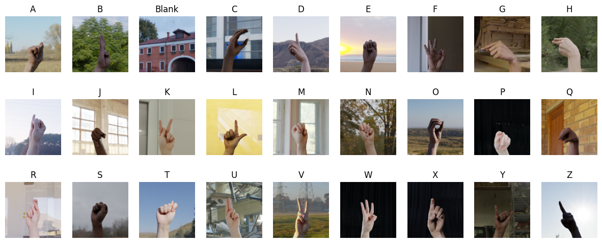
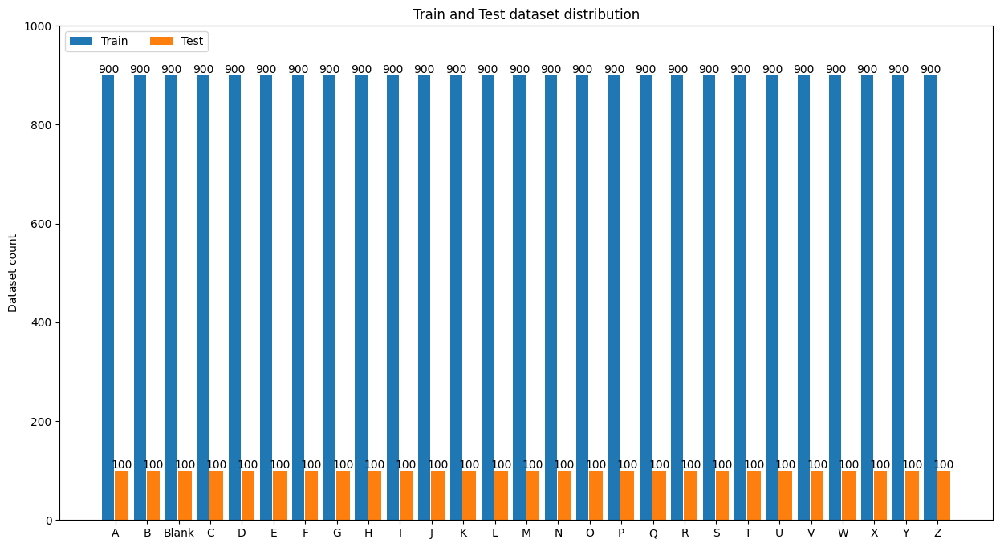

# ASL-Recognition-with-Deep-Learning-PyTorch

The image-based component of the American Sign Language (ASL) dataset comprises a vast array of high-resolution photographs capturing individual sign gestures and expressions. Each image is meticulously annotated to denote the specific sign being performed, providing valuable ground truth data for training and evaluation purposes. These images represent a diverse range of hand shapes, movements, and facial expressions, captured under various lighting conditions and backgrounds to simulate real-world scenarios. Researchers and developers leverage this image dataset to train deep learning models for accurate sign language recognition and understanding. By focusing solely on images, this segment of the ASL dataset enables the development of computer vision algorithms tailored specifically to analyze and interpret visual cues inherent in sign language communication.

**Data Source:** [Kaggle: Synthetic ASL Alphabet](https://www.kaggle.com/datasets/lexset/synthetic-asl-alphabet)

This dataset created by Lexset contains 27000 images of the alphabet signed in American Sign Language. Each image is 512 x 512. The data is separated into a training and testing set. Within each set, there are 27 folders, one for each letter and an extra folder of random backgrounds. Each training folder contains 900 examples while each testing folder contains 100 examples.

# References:

1. https://www.kaggle.com/datasets/lexset/synthetic-asl-alphabet
2. https://pytorch.org/tutorials/beginner/blitz/cifar10_tutorial.html
